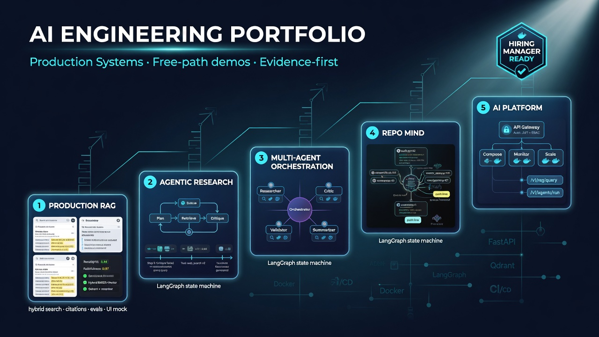
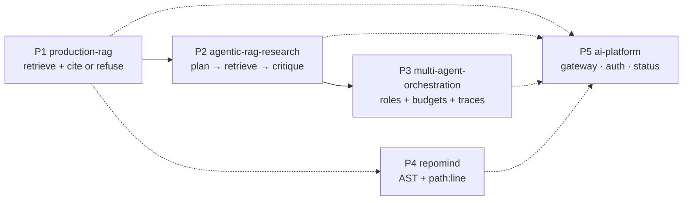

<p align="center">
  
</p>

<h1 align="center">Pablo Alvarez</h1>
<p align="center"><strong>AI Engineer · LLM Systems · Applied Product</strong></p>
<p align="center">
  Chile ·
  <a href="https://paxdev.vercel.app">paxdev.vercel.app</a> ·
  <a href="https://github.com/pabloalvarez99">github.com/pabloalvarez99</a>
</p>

<p align="center">
  I design <em>production-shaped</em> AI systems: hybrid retrieval, grounded generation,
  bounded agents, multi-agent control, code intelligence, and the evaluation/ops seams
  around them. Every public AI repo clones and demos on a <strong>free path</strong> —
  no API key, $0 billed, CI with empty provider secrets.
</p>

<p align="center">
  <a href="https://paxdev.vercel.app"></a>
  <a href="https://github.com/pabloalvarez99/production-rag/releases/tag/v0.1.0"></a>
  <a href="https://github.com/pabloalvarez99/agentic-rag-research/releases/tag/v0.1.0"></a>
  <a href="https://github.com/pabloalvarez99?tab=repositories"></a>
</p>

<p align="center">
  
  
  
  
  
  
</p>

---

## Hiring signal

**Open to:** AI Engineer · LLM Engineer · Applied AI · AI Platform / Applied ML (mid–senior).

A hiring manager can verify, in a browser, that I do not ship prompt demos:

| What companies actually need | What is public and runnable |
| --- | --- |
| Retrieval that survives real corpora | Dense + BM25 sparse in Qdrant, RRF, optional cross-encoder, fail-open rerank |
| Answers a lawyer can audit | Citation markers resolve to chunks that were in the prompt; otherwise **refuse** |
| Agents that stop | Step budgets in state, typed stop reasons, full traces |
| Multi-agent that is not cosplay | Writer-only finals, handoff policy, isolation, `degraded` instead of silent success |
| Evaluation that is honest | Offline goldens, scorecards labelled as **contract / plumbing**, never fake SOTA |
| Operations instinct | FastAPI, request IDs, Docker, CI that **fails** if the free path needs a key |
| I also ship products | Rust/Axum ERP, Kotlin Android, Next.js, SurrealDB, offline-first Chile |

> Production-shaped AI systems: free-path demos, real architecture, measurable behavior, honest scope.

**Start here (15 minutes, $0):** [production-rag](https://github.com/pabloalvarez99/production-rag) → ask a grounded question → ask an unanswerable one → watch it refuse. Then [agentic-rag-research](https://github.com/pabloalvarez99/agentic-rag-research) to see the loop, budget, and trace.

---

## The AI systems ladder

All five public systems are **LIVE at a tagged `v0.1.0`**, each on a `main` whose latest
CI run is green, each with a documented free path. Verified against GitHub on 2026-08-14.



| # | System | Demonstrates | Status | Evidence |
| --- | --- | --- | --- | --- |
| 1 | [production-rag](https://github.com/pabloalvarez99/production-rag) | Hybrid RAG with RRF, optional rerank, grounded generation (citations + refusal), free-path evals and UI | **LIVE v0.1.0** | [release](https://github.com/pabloalvarez99/production-rag/releases/tag/v0.1.0) at `678c554` · green `main` `62cc15f` (metadata filters, [ADR 0011](https://github.com/pabloalvarez99/production-rag/blob/main/docs/adr/0011-metadata-filters.md)) · [CI](https://github.com/pabloalvarez99/production-rag/actions/workflows/ci.yml) · [case study](https://github.com/pabloalvarez99/production-rag/blob/main/docs/CASESTUDY.md) · [SHIP](https://github.com/pabloalvarez99/production-rag/blob/main/docs/SHIP.md) |
| 2 | [agentic-rag-research](https://github.com/pabloalvarez99/agentic-rag-research) | Research agent with tool-based retrieval, step budgets, stop reasons, notes, and full traces | **LIVE v0.1.0** | [release](https://github.com/pabloalvarez99/agentic-rag-research/releases/tag/v0.1.0) at `18c1ff9` · green `main` `57ce423` · [CI](https://github.com/pabloalvarez99/agentic-rag-research/actions/workflows/ci.yml) · [SHIP](https://github.com/pabloalvarez99/agentic-rag-research/blob/main/docs/SHIP.md) |
| 3 | [multi-agent-orchestration](https://github.com/pabloalvarez99/multi-agent-orchestration) | Explicit roles, handoff budgets, degradation modes, and auditable traces | **LIVE v0.1.0** | [release](https://github.com/pabloalvarez99/multi-agent-orchestration/releases/tag/v0.1.0) at `e2687ca` · green `main` `78b3910` · [CI](https://github.com/pabloalvarez99/multi-agent-orchestration/actions/workflows/ci.yml) · [SHIP](https://github.com/pabloalvarez99/multi-agent-orchestration/blob/main/docs/SHIP.md) |
| 4 | [repomind](https://github.com/pabloalvarez99/repomind) | Repository Q&A with AST-aware chunking and grounded `path:line` citations | **LIVE v0.1.0** | [release](https://github.com/pabloalvarez99/repomind/releases/tag/v0.1.0) at `327a949` · green `main` `1db33ab` · [CI](https://github.com/pabloalvarez99/repomind/actions/workflows/ci.yml) · [SHIP](https://github.com/pabloalvarez99/repomind/blob/main/docs/SHIP.md) |
| 5 | [ai-platform](https://github.com/pabloalvarez99/ai-platform) | Gateway edge for the portfolio: API-key auth, per-key rate limiting, health aggregation, and Compose delivery | **LIVE v0.1.0** | [release](https://github.com/pabloalvarez99/ai-platform/releases/tag/v0.1.0) at `7978a00` · **[hosted gateway](https://pax-ai-gateway.vercel.app)** from `main` `2fd74c7` · that `main` is lint-red on the two Vercel entrypoint shims, last all-green `main` `4318531` · [CI](https://github.com/pabloalvarez99/ai-platform/actions/workflows/ci.yml) · [SHIP](https://github.com/pabloalvarez99/ai-platform/blob/main/docs/SHIP.md) |

**Footnotes, because a scorecard is a contract.** P3 goldens measure **routing contracts** on deterministic fake specialists, not “agents beat a single model.” RepoMind goldens measure **citation plumbing** on a fixture, not SOTA over arbitrary repos. Free-path scorecards are billed **USD 0**.

**P5 does not host the other four.** Its free path is the gateway alone: upstream URLs are empty in CI and in the documented demo, so P1–P4 answer `upstream_unconfigured` instead of running for a visitor. The rate limiter is an in-process fixed window on a single instance — not a distributed limiter — and `dev-local` is a public fixture key committed to the repo, not a credential. No hosted multi-service deployment and no TLS termination are claimed.

**Try hosted:** [pax-ai-gateway.vercel.app](https://pax-ai-gateway.vercel.app) — the gateway itself, running, no clone. `GET /health` is open; `GET /v1/platform/status` returns `401` without a key and answers when you pass the public fixture header `X-API-Key: dev-local`:

```bash
curl https://pax-ai-gateway.vercel.app/health
curl -H "X-API-Key: dev-local" https://pax-ai-gateway.vercel.app/v1/platform/status
```

Verified 2026-08-14: `200`, then `401`, then `gateway: up` with `rag`, `research`, `mao`, and `repomind` reporting `unconfigured` — which is the point. One hosted gateway, not five hosted systems.

Site map of the same ladder: **[paxdev.vercel.app](https://paxdev.vercel.app)**.

### See it without cloning

Each system commits its own UI captures. These are the official ones, pinned to the commit that
produced them — no mockup, no screenshot I cannot reproduce with a documented command. P5 is the
only system you can also hit over HTTP; the other four still run locally.

| System | Capture | What it proves |
| --- | --- | --- |
| P1 | [grounded answer + demo GIF](https://github.com/pabloalvarez99/production-rag/blob/129a46d/docs/assets/production-rag-demo.gif) | Citations resolve, and the same run refuses when evidence is missing |
| P2 | [completed run](https://github.com/pabloalvarez99/agentic-rag-research/blob/57ce423/docs/assets/ui-done.png) · [budget](https://github.com/pabloalvarez99/agentic-rag-research/blob/57ce423/docs/assets/ui-budget.png) · [trace](https://github.com/pabloalvarez99/agentic-rag-research/blob/57ce423/docs/assets/ui-trace.png) | The loop stops on a typed reason, and the trace shows why |
| P3 | [done](https://github.com/pabloalvarez99/multi-agent-orchestration/blob/78b3910/docs/assets/ui-done.png) · [budget](https://github.com/pabloalvarez99/multi-agent-orchestration/blob/78b3910/docs/assets/ui-budget.png) · [handoff trace](https://github.com/pabloalvarez99/multi-agent-orchestration/blob/78b3910/docs/assets/ui-trace.png) | Handoffs are auditable, and the budget is a state field |
| P4 | [dogfood hit](https://github.com/pabloalvarez99/repomind/blob/a9b0acb/docs/assets/ui-dogfood-hit.png) · [mini hit](https://github.com/pabloalvarez99/repomind/blob/a9b0acb/docs/assets/ui-mini-hit.png) · [refusal](https://github.com/pabloalvarez99/repomind/blob/a9b0acb/docs/assets/ui-mini-refuse.png) | `path:line` citations on its own repository — and a refusal when the fixture has no answer |
| P5 | [status: unconfigured](https://github.com/pabloalvarez99/ai-platform/blob/4318531/docs/assets/ui-status-unconfigured.png) | The gateway says `upstream_unconfigured` instead of faking four healthy services |

Walking someone through it live: [**production-rag/docs/DEMO-DAY.md**](https://github.com/pabloalvarez99/production-rag/blob/main/docs/DEMO-DAY.md) — a 45-minute script from cold clone to refusal.

---

## Depth — what I actually implement

### Retrieval, grounding, evaluation
- Named dense + sparse vectors, BM25 weights, **RRF**, optional cross-encoder with **fail-open**
- Citation validation against the prompt context (not a later retrieval list)
- First-class **refusal** when evidence is missing
- Two-tier evals: retrieval (`source_hit@k`, recall, MRR, nDCG) vs answer/citation judges
- Ablations (dense / sparse / hybrid / hybrid+rerank) and honest scorecard labels
- Observability seams: `request_id`, timings, NullTracer default, debug allowlists

### Agents, control, multi-agent
- Tools behind a protocol (`RetrieverPort`, `Tool`, `Agent`) + Fake + optional HTTP
- Budgets **in state**, not in the prompt: `max_steps`, `max_handoffs`, critic retries
- Terminal statuses: `done` · `refused` · `budget_exhausted` · `degraded`
- Byte-stable traces on the free path (no wall-clock in equality tests)
- Writer-only user-facing text; specialist crash → explicit degraded, never empty success

### Code intelligence
- AST chunks (`path::qualname`, exact line ranges), sandbox via catalog `repo_id` (never raw paths)
- Deterministic lexical index: exact symbol match dominates, then token overlap

### Product engineering (I ship more than notebooks)
| Surface | Public work |
| --- | --- |
| Rust / Axum / SurrealDB | [pharma-server](https://github.com/pabloalvarez99/pharma-server) — offline-first ERP/POS (RutBusiness) |
| Kotlin / Android | Native client in the same product family |
| TypeScript / Next.js | [FarmaciaCompare](https://github.com/pabloalvarez99/FarmaciaCompare) · [Prescribo](https://github.com/pabloalvarez99/prescribo) · [paxdev](https://github.com/pabloalvarez99/paxdev) |
| Geo / maps | [GeoAgent-App](https://github.com/pabloalvarez99/GeoAgent-App) |
| Delivery | GitHub Actions, Docker, ADRs, SECURITY.md, release tags, empty-key CI |

---

## Clone any LIVE system

```text
git clone https://github.com/pabloalvarez99/production-rag
git clone https://github.com/pabloalvarez99/agentic-rag-research
git clone https://github.com/pabloalvarez99/multi-agent-orchestration
git clone https://github.com/pabloalvarez99/repomind
git clone https://github.com/pabloalvarez99/ai-platform
```

No `.env` required. Provider keys in CI are empty on purpose. Hosted OpenAI/Cohere paths exist as **opt-in** extras and are not needed to review the architecture.

---

## Interview me on

These are the trade-offs I can walk without slides:

1. Why **RRF** over a weighted sum of dense and sparse scores  
2. Why citation markers must map to **prompt blocks**, not the raw hit list  
3. Why **refuse > hallucinate**, and why provider failure is an error, not a refusal  
4. Why fake providers belong in CI, and why their metrics are not quality claims  
5. Why agent loops die by **budget**, not by “the model decided to stop”  
6. Why only Writer may speak to the user in a multi-agent graph  
7. Why a code-QA API takes `repo_id`, never a caller filesystem path  

---

## Stack I use in public code

<p align="center">
  
  
  
  
  
  
  
  
  
  
  
  
</p>

<p align="center">
  
  
  
  
  
</p>

<p align="center"><sub>Static badges on purpose. A generated stats card that 503s is a broken promise on the first screen a reviewer sees.</sub></p>

---

## How I work

- **Free path first.** Default embedder / LLM / retriever / judge run offline. Hosted providers are extras.
- **Evidence or refusal.** Uncited claims are bugs.
- **Deterministic tests.** Fake providers are constructed so tests assert on exact traces, not vibes.
- **Named failures.** `degraded`, `budget_exhausted`, `unauthorized`, `upstream_unconfigured` — never a 200 with empty meaning.
- **Secrets never committed.** Empty `.env.example`. CI with empty `OPENAI_API_KEY`. Logs mask credentials.
- **LIVE vs PLANNED is a contract.** If a row says LIVE, there is a test and a clone path. If it says PLANNED, there is no fake link.

---

<p align="center">
  <a href="https://paxdev.vercel.app">Portfolio site</a> ·
  <a href="https://github.com/pabloalvarez99/production-rag">Flagship RAG</a> ·
  <a href="https://github.com/pabloalvarez99/agentic-rag-research">Research agent</a> ·
  <a href="https://github.com/pabloalvarez99/multi-agent-orchestration">Multi-agent</a> ·
  <a href="https://github.com/pabloalvarez99/repomind">RepoMind</a> ·
  <a href="https://github.com/pabloalvarez99/ai-platform">AI Platform</a>
</p>
