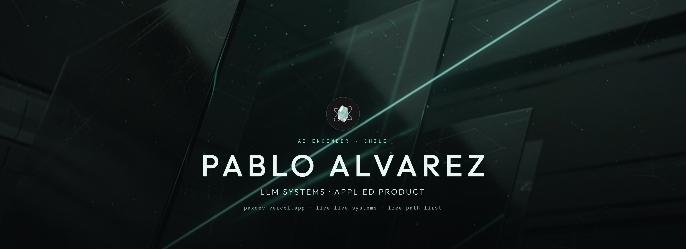
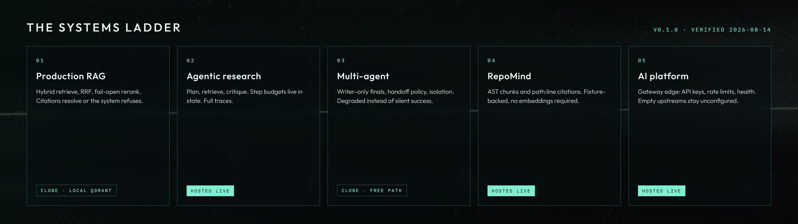
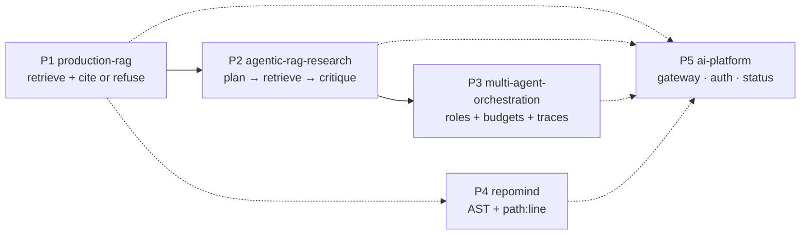

<p align="center">
  
</p>

<p align="center">
  <a href="https://paxdev.vercel.app"></a>
  <a href="https://pax-agentic-rag.vercel.app"></a>
  <a href="https://pax-repomind.vercel.app"></a>
  <a href="https://pax-ai-gateway.vercel.app"></a>
  <a href="https://pax-orchestration.vercel.app"></a>
</p>

<p align="center">
  
  
  
  
  
  
</p>

<p align="center">
  I design <em>production-shaped</em> AI systems: hybrid retrieval, grounded generation,
  bounded agents, multi-agent control, code intelligence, and the evaluation/ops seams
  around them. Every public AI repo clones and demos on a <strong>free path</strong> —
  no API key, $0 billed, CI with empty provider secrets.
</p>

<p align="center">
  
</p>

<p align="center">
  
</p>

---

## Hiring signal

**Open to:** AI Engineer · LLM Engineer · Applied AI · AI Platform / Applied ML (mid–senior).

A hiring manager can verify, in a browser, that I do not ship prompt demos:

| What companies actually need | What is public and runnable |
| --- | --- |
| Retrieval that survives real corpora | Dense + BM25 sparse in Qdrant, RRF, optional cross-encoder, fail-open rerank |
| Answers a lawyer can audit | Citation markers resolve to chunks that were in the prompt; otherwise **refuse** |
| Agents that stop | Step budgets in state, typed stop reasons, full traces |
| Multi-agent that is not cosplay | Writer-only finals, handoff policy, isolation, `degraded` instead of silent success |
| Evaluation that is honest | Offline goldens, scorecards labelled as **contract / plumbing**, never fake SOTA |
| Operations instinct | FastAPI, request IDs, Docker, CI that **fails** if the free path needs a key |
| I also ship products | Rust/Axum ERP, Kotlin Android, Next.js, SurrealDB, offline-first Chile |

> Production-shaped AI systems: free-path demos, real architecture, measurable behavior, honest scope.

**Fifteen minutes, $0, no clone required:**

1. [RepoMind](https://pax-repomind.vercel.app) — ask *Where is `create_app` defined?* and read a `path:line` citation. Then ask something the fixture cannot know and watch it refuse.
2. [Research agent](https://pax-agentic-rag.vercel.app) — run a loop, then open the trace and the budget.
3. [Multi-agent orchestration](https://pax-orchestration.vercel.app) — submit a task, read the ordered handoff timeline; `GET /health` returns `{"status":"ok"}`.
4. [AI gateway](https://pax-ai-gateway.vercel.app) — `/health` is public; `/v1/platform/status` is 401 without a key. The public fixture `X-API-Key: dev-local` returns `gateway: up` with `rag` / `research` / `mao` / `repomind` as `unconfigured` — that is the point.

```bash
curl https://pax-orchestration.vercel.app/health
curl https://pax-ai-gateway.vercel.app/health
curl -H "X-API-Key: dev-local" https://pax-ai-gateway.vercel.app/v1/platform/status
```

Interview script (minute marks + exact click/curl): [paxdev.vercel.app/interview](https://paxdev.vercel.app/interview).

**Then clone the flagship** [production-rag](https://github.com/pabloalvarez99/production-rag) if you want hybrid retrieval against Qdrant: ask a grounded question, ask an unanswerable one, watch it refuse. Script: [DEMO-DAY.md](https://github.com/pabloalvarez99/production-rag/blob/main/docs/DEMO-DAY.md).

---

## The AI systems ladder

All five public systems are **LIVE** at tagged `v1.0.0`, each on a `main` whose latest CI run is green, each with a documented free path. Verified against GitHub on 2026-08-14 (A2 v1-season Week 1). Pin table matches [paxdev `content/pins.json`](https://github.com/pabloalvarez99/paxdev/blob/main/content/pins.json).



| # | System | Demonstrates | Status | Click |
| --- | --- | --- | --- | --- |
| 1 | [production-rag](https://github.com/pabloalvarez99/production-rag) | Hybrid RAG with RRF, optional rerank, grounded generation, allowlisted filter control, stream, filter-aware cache, free-path evals | **LIVE v1.0.0** · clone | [release](https://github.com/pabloalvarez99/production-rag/releases/tag/v1.0.0) · `main` `3b54d85` · [CI](https://github.com/pabloalvarez99/production-rag/actions/workflows/ci.yml) · [case study](https://github.com/pabloalvarez99/production-rag/blob/main/docs/CASESTUDY.md) |
| 2 | [agentic-rag-research](https://github.com/pabloalvarez99/agentic-rag-research) | Research agent with tool-based retrieval, step budgets, stop reasons, notes, and full traces | **LIVE v1.0.0** · [hosted](https://pax-agentic-rag.vercel.app) | [release](https://github.com/pabloalvarez99/agentic-rag-research/releases/tag/v1.0.0) · `main` `1b4915f` · [CI](https://github.com/pabloalvarez99/agentic-rag-research/actions/workflows/ci.yml) |
| 3 | [multi-agent-orchestration](https://github.com/pabloalvarez99/multi-agent-orchestration) | Explicit roles, handoff budgets, degradation modes, and auditable traces | **LIVE v1.0.0** · [hosted](https://pax-orchestration.vercel.app) | [release](https://github.com/pabloalvarez99/multi-agent-orchestration/releases/tag/v1.0.0) · `main` `88a24f2` · [CI](https://github.com/pabloalvarez99/multi-agent-orchestration/actions/workflows/ci.yml) |
| 4 | [repomind](https://github.com/pabloalvarez99/repomind) | Repository Q&A with AST-aware chunking and grounded `path:line` citations | **LIVE v1.0.0** · [hosted](https://pax-repomind.vercel.app) | [release](https://github.com/pabloalvarez99/repomind/releases/tag/v1.0.0) · `main` `91fa395` · [CI](https://github.com/pabloalvarez99/repomind/actions/workflows/ci.yml) |
| 5 | [ai-platform](https://github.com/pabloalvarez99/ai-platform) | Gateway edge: API-key auth, per-key rate limiting, health aggregation, Compose and Vercel | **LIVE v1.0.0** · [hosted](https://pax-ai-gateway.vercel.app) | [release](https://github.com/pabloalvarez99/ai-platform/releases/tag/v1.0.0) · `main` `801fc0b` · [CI](https://github.com/pabloalvarez99/ai-platform/actions/workflows/ci.yml) |

**Footnotes, because a scorecard is a contract.** P3 goldens measure **routing contracts** on deterministic fake specialists, not “agents beat a single model.” RepoMind goldens measure **citation plumbing** on a fixture, not SOTA over arbitrary repos. The hosted RepoMind indexes two committed snapshots and nothing else. Free-path scorecards are billed **USD 0**.

**P5 does not host the other four.** Its free path is the gateway alone: upstream URLs are empty in CI and on Vercel, so P1–P4 answer `upstream_unconfigured` instead of running for a visitor. The rate limiter is an in-process fixed window on a single instance — not a distributed limiter — and `dev-local` is a public fixture key committed to the repo, not a credential. **P1 is not hosted:** hybrid retrieval needs local Qdrant. PR #3 (stream + filter-aware cache + /evals) is **merged** on main `3b54d85` / v1.0.0. **P3 is hosted** at [pax-orchestration.vercel.app](https://pax-orchestration.vercel.app) (`/health` 200 verified 2026-08-14); specialists remain deterministic fakes. Never cite `production-rag.vercel.app` (Ipsura). GitHub name/bio/pins cannot be set via fine-grained PAT (`PATCH /user` → 403) — do not read missing API-updated profile fields as a product claim.

Site map of the same ladder: **[paxdev.vercel.app](https://paxdev.vercel.app)**.

### Evidence, not mockups

These captures are committed on the green `main` SHAs above. They are reproducible with documented commands.

<p align="center">
  <a href="https://github.com/pabloalvarez99/production-rag/blob/3b54d85/docs/assets/production-rag-demo.gif"></a>
  &nbsp;
  <a href="https://pax-agentic-rag.vercel.app"></a>
  &nbsp;
  <a href="https://github.com/pabloalvarez99/multi-agent-orchestration/blob/88a24f2/docs/assets/ui-done.png"></a>
</p>
<p align="center">
  <a href="https://pax-repomind.vercel.app"></a>
  &nbsp;
  <a href="https://pax-ai-gateway.vercel.app"></a>
</p>

| System | More captures | What it proves |
| --- | --- | --- |
| P1 | [demo GIF](https://github.com/pabloalvarez99/production-rag/blob/3b54d85/docs/assets/production-rag-demo.gif) · [refusal](https://github.com/pabloalvarez99/production-rag/blob/3b54d85/docs/assets/ui-refusal.png) · [filtered](https://github.com/pabloalvarez99/production-rag/blob/3b54d85/docs/assets/ui-filtered.png) · [stream](https://github.com/pabloalvarez99/production-rag/blob/3b54d85/docs/assets/ui-stream.png) | Citations resolve, the same run refuses when evidence is missing, the filter control offers only fields the API would accept, and stream is additive on main |
| P2 | [budget](https://github.com/pabloalvarez99/agentic-rag-research/blob/1b4915f/docs/assets/ui-budget.png) · [trace](https://github.com/pabloalvarez99/agentic-rag-research/blob/1b4915f/docs/assets/ui-trace.png) | The loop stops on a typed reason, and the trace shows why |
| P3 | [budget](https://github.com/pabloalvarez99/multi-agent-orchestration/blob/88a24f2/docs/assets/ui-budget.png) · [handoff trace](https://github.com/pabloalvarez99/multi-agent-orchestration/blob/88a24f2/docs/assets/ui-trace.png) | Handoffs are auditable, and the budget is a state field |
| P4 | [dogfood](https://github.com/pabloalvarez99/repomind/blob/91fa395/docs/assets/ui-dogfood-hit.png) · [refusal](https://github.com/pabloalvarez99/repomind/blob/91fa395/docs/assets/ui-mini-refuse.png) | `path:line` on a fixture — and a refusal when there is no answer |
| P5 | [unconfigured](https://github.com/pabloalvarez99/ai-platform/blob/801fc0b/docs/assets/ui-status-unconfigured.png) | The gateway says `upstream_unconfigured` instead of faking four healthy services |

---

## Depth — what I actually implement

### Retrieval, grounding, evaluation
- Named dense + sparse vectors, BM25 weights, **RRF**, optional cross-encoder with **fail-open**
- Citation validation against the prompt context (not a later retrieval list)
- First-class **refusal** when evidence is missing
- Allowlist metadata filters, fail-closed
- Two-tier evals: retrieval (`source_hit@k`, recall, MRR, nDCG) vs answer/citation judges
- Ablations (dense / sparse / hybrid / hybrid+rerank) and honest scorecard labels
- Observability seams: `request_id`, timings, NullTracer default, debug allowlists

### Agents, control, multi-agent
- Tools behind a protocol (`RetrieverPort`, `Tool`, `Agent`) + Fake + optional HTTP
- Budgets **in state**, not in the prompt: `max_steps`, `max_handoffs`, critic retries
- Terminal statuses: `done` · `refused` · `budget_exhausted` · `degraded`
- Byte-stable traces on the free path (no wall-clock in equality tests)
- Writer-only user-facing text; specialist crash → explicit degraded, never empty success

### Code intelligence
- AST chunks (`path::qualname`, exact line ranges), sandbox via catalog `repo_id` (never raw paths)
- Deterministic lexical index: exact symbol match dominates, then token overlap

### Product engineering (I ship more than notebooks)
| Surface | Public work |
| --- | --- |
| Rust / Axum / SurrealDB | [pharma-server](https://github.com/pabloalvarez99/pharma-server) — offline-first ERP/POS (RutBusiness) |
| Kotlin / Android | Native client in the same product family |
| TypeScript / Next.js | [FarmaciaCompare](https://github.com/pabloalvarez99/FarmaciaCompare) · [Prescribo](https://github.com/pabloalvarez99/prescribo) · [paxdev](https://github.com/pabloalvarez99/paxdev) |
| Geo / maps | [GeoAgent-App](https://github.com/pabloalvarez99/GeoAgent-App) |
| Delivery | GitHub Actions, Docker, ADRs, SECURITY.md, release tags, empty-key CI, Vercel |

---

## Clone any LIVE system

```text
git clone https://github.com/pabloalvarez99/production-rag
git clone https://github.com/pabloalvarez99/agentic-rag-research
git clone https://github.com/pabloalvarez99/multi-agent-orchestration
git clone https://github.com/pabloalvarez99/repomind
git clone https://github.com/pabloalvarez99/ai-platform
```

No `.env` required. Provider keys in CI are empty on purpose. Hosted OpenAI/Cohere paths exist as **opt-in** extras and are not needed to review the architecture.

---

## Interview me on

These are the trade-offs I can walk without slides:

1. Why **RRF** over a weighted sum of dense and sparse scores
2. Why citation markers must map to **prompt blocks**, not the raw hit list
3. Why **refuse > hallucinate**, and why provider failure is an error, not a refusal
4. Why fake providers belong in CI, and why their metrics are not quality claims
5. Why agent loops die by **budget**, not by “the model decided to stop”
6. Why only Writer may speak to the user in a multi-agent graph
7. Why a code-QA API takes `repo_id`, never a caller filesystem path

---

## Stack I use in public code

<p align="center">
  
  
  
  
  
  
  
  
  
  
  
  
  
</p>

<p align="center"><sub>Static badges on purpose. A generated stats card that 503s is a broken promise on the first screen a reviewer sees.</sub></p>

---

## How I work

- **Free path first.** Default embedder / LLM / retriever / judge run offline. Hosted providers are extras.
- **Evidence or refusal.** Uncited claims are bugs.
- **Deterministic tests.** Fake providers are constructed so tests assert on exact traces, not vibes.
- **Named failures.** `degraded`, `budget_exhausted`, `unauthorized`, `upstream_unconfigured` — never a 200 with empty meaning.
- **Secrets never committed.** Empty `.env.example`. CI with empty `OPENAI_API_KEY`. Logs mask credentials.
- **LIVE vs PLANNED is a contract.** If a row says LIVE, there is a test and a clone path. If it says PLANNED, there is no fake link.

---

<p align="center">
  
</p>

<p align="center">
  <a href="https://paxdev.vercel.app">Portfolio site</a> ·
  <a href="https://github.com/pabloalvarez99/production-rag">Flagship RAG</a> ·
  <a href="https://pax-agentic-rag.vercel.app">Research agent</a> ·
  <a href="https://github.com/pabloalvarez99/multi-agent-orchestration">Multi-agent</a> ·
  <a href="https://pax-repomind.vercel.app">RepoMind</a> ·
  <a href="https://pax-ai-gateway.vercel.app">AI Platform</a>
</p>

